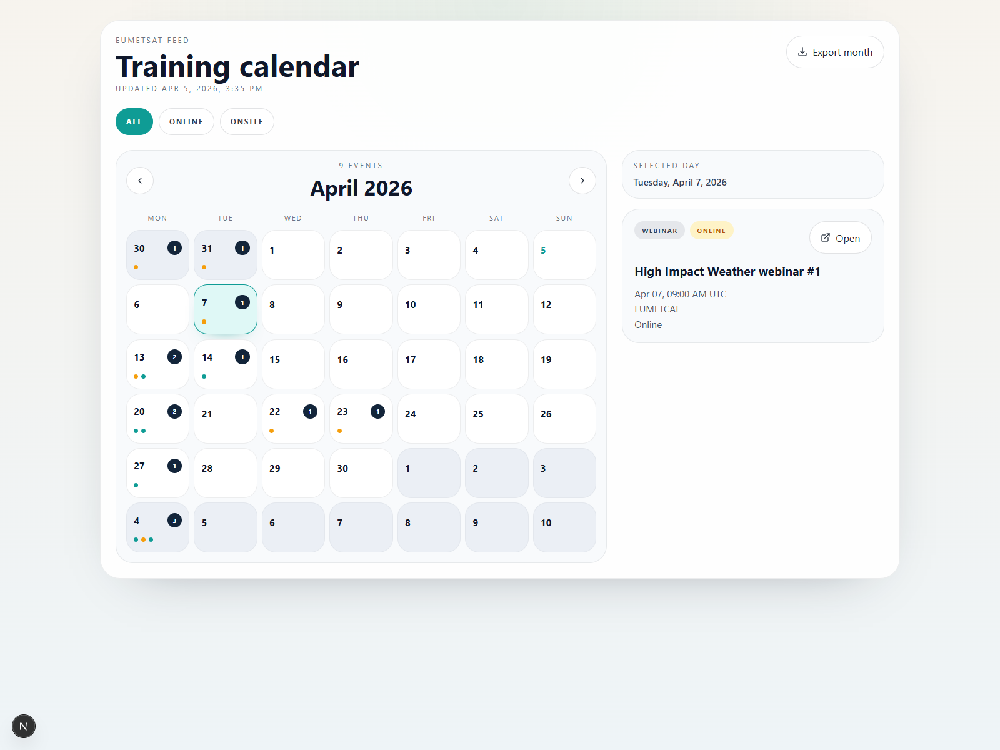
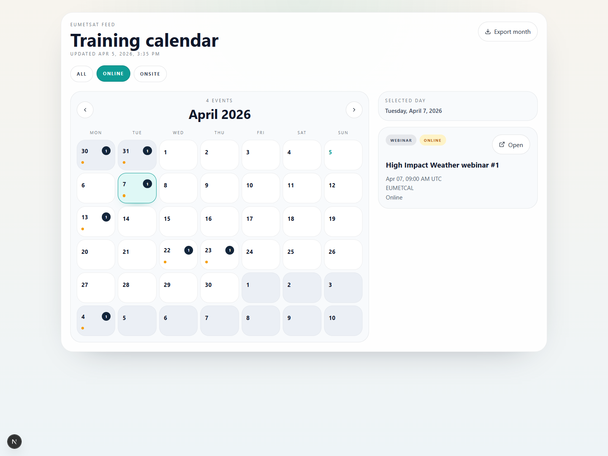
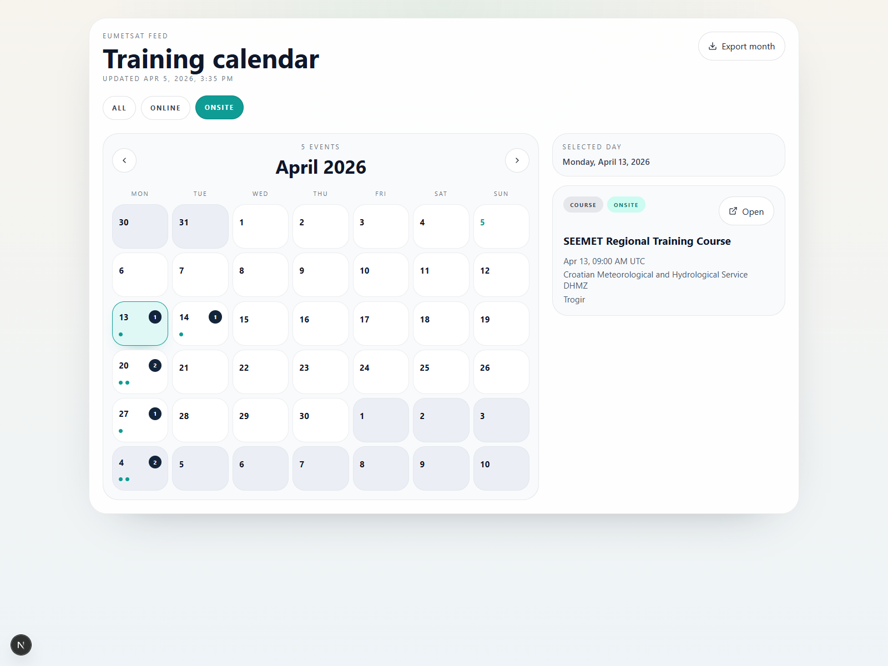
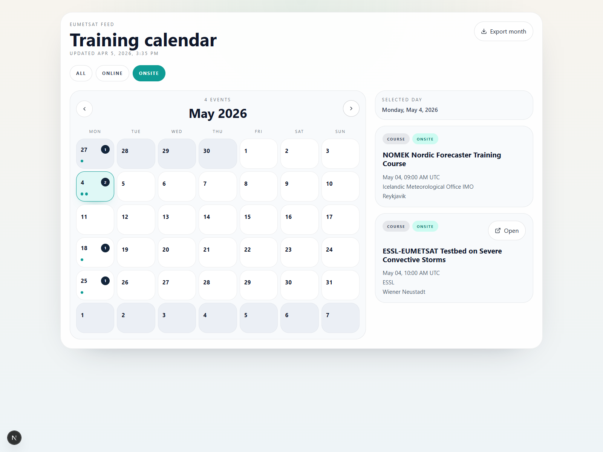

# EUMETSAT Calendar Guide

Standalone `Next.js` reference implementation for the public EUMETSAT training events feed.

This package is designed to be copied into another project or published as its own repository. The rendered page contains only the functional calendar interface. The implementation details are documented in code comments and in [docs/TECHNICAL_GUIDE.md](./docs/TECHNICAL_GUIDE.md).

If you want a step-by-step implementation guide focused on the EUMETSAT API integration itself, from XML collection to calendar rendering and `.ics` export, start with [docs/API_USAGE_AND_DEVELOPMENT_WALKTHROUGH.md](./docs/API_USAGE_AND_DEVELOPMENT_WALKTHROUGH.md).

The target audience is international scientific and technical teams that need to:

- consume the public EUMETSAT training feed without relying on UI scraping;
- normalize the XML feed into a stable JSON contract;
- display a responsive calendar that stays fresh over time;
- export the current monthly view as an `.ics` calendar file;
- reuse the same integration pattern inside another dashboard or portal.

## What is included

- `app/eumetsat-calendar/page.tsx`: standalone calendar page.
- `app/api/eumetsat-calendar/events/route.ts`: JSON endpoint backed by the cached EUMETSAT feed.
- `app/api/eumetsat-calendar/export/route.ts`: `.ics` export endpoint.
- `components/eumetsat-calendar-panel.tsx`: interactive month view and event list.
- `lib/calendar-types.ts`: typed contracts for normalized events and filters.
- `lib/calendar-utils.ts`: UTC-safe date helpers, filtering, and `.ics` generation.
- `lib/eumetsat-feed.ts`: XML fetch, normalization, deduplication, timeout handling, and in-memory cache.
- `screenshots/`: captured UI states for review and onboarding.
- `docs/TECHNICAL_GUIDE.md`: end-to-end technical guide.
- `docs/API_USAGE_AND_DEVELOPMENT_WALKTHROUGH.md`: implementation walkthrough for the EUMETSAT XML-to-calendar pipeline.

## Run as a standalone app

This directory is a self-contained mini `Next.js` application. It does not need to be mounted into any other app.

```bash
npm install
npm run dev
```

Then open [http://localhost:3010/eumetsat-calendar](http://localhost:3010/eumetsat-calendar).

## Reuse inside another project

1. Copy this package into the target repository or clone the repository directly.
2. If you want to keep it isolated, run it as its own mini app from the package root.
3. If you want to embed it into an existing dashboard, move `app/`, `components/`, and `lib/` into the equivalent folders in your host project.
4. Update import paths if your folder hierarchy changes.
5. Tune `GUIDE_CALENDAR_CACHE_TTL_MS`, `GUIDE_EUMETSAT_TIMEOUT_MS`, and the client polling intervals to match your operational needs.
6. Validate both `/eumetsat-calendar` and `/api/eumetsat-calendar/events`.

## Screenshots

Overview:



Online filter:



On-site filter:



Next month:



## Primary references

- [EUMETSAT guide: Getting started using data](https://user.eumetsat.int/resources/user-guides/getting-started-using-data)
- [EUMETSAT public training endpoint](https://trainingevents.eumetsat.int/trapi/resources/public/events)
- [EUMETSAT user portal dashboard](https://user.eumetsat.int/dashboard)
