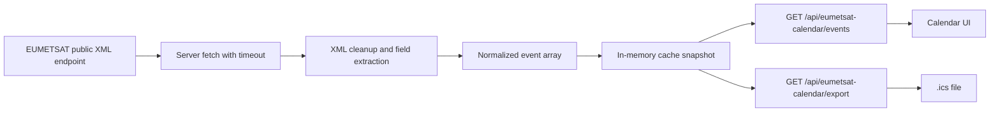

# EUMETSAT API Implementation Walkthrough

## Scope

This document is not a user guide for the calendar page itself.

Its purpose is to explain, step by step, how this repository was configured to consume the public EUMETSAT training API, transform the upstream XML feed into a normalized dataset, render that dataset in a calendar, and export the same filtered slice as `.ics`.

The intended audience is technical teams, scientific institutions, and developers who want to understand or reproduce the integration end to end.

## Primary upstream references

- [EUMETSAT public training events endpoint](https://trainingevents.eumetsat.int/trapi/resources/public/events)
- [EUMETSAT dashboard](https://user.eumetsat.int/dashboard)
- [EUMETSAT guide: Getting started using data](https://user.eumetsat.int/resources/user-guides/getting-started-using-data)

## High-level pipeline

The application is built as a pipeline with four distinct stages:

1. collect XML from the public EUMETSAT endpoint;
2. normalize XML into a stable TypeScript-friendly event contract;
3. serve the normalized dataset through local route handlers;
4. render the dataset in a month calendar and export the same slice as `.ics`.



## File map

These are the files that implement the integration:

- `lib/eumetsat-feed.ts`
  Collects and normalizes data from the EUMETSAT API.

- `lib/calendar-types.ts`
  Defines the normalized event model used across the app.

- `lib/calendar-utils.ts`
  Implements UTC-safe date helpers, filtering, and `.ics` generation.

- `app/api/eumetsat-calendar/events/route.ts`
  Exposes the cached normalized dataset as JSON.

- `app/api/eumetsat-calendar/export/route.ts`
  Exposes the `.ics` export based on the same filtered event slice.

- `app/eumetsat-calendar/page.tsx`
  Server entry point that renders the page shell and triggers warmup.

- `components/eumetsat-calendar-panel.tsx`
  Client-side calendar that fetches the local JSON route and renders the month view.

## Step 1: define the upstream source

The integration starts in `lib/eumetsat-feed.ts`:

```ts
const GUIDE_EUMETSAT_EVENTS_ENDPOINT =
  "https://trainingevents.eumetsat.int/trapi/resources/public/events";
```

This repository intentionally uses the public feed instead of scraping the dashboard HTML. The dashboard is a presentation layer; the XML endpoint is the data source.

That choice gives three benefits:

- more stable integration points;
- easier testing and debugging;
- a clean separation between upstream data and local UI.

## Step 2: configure server-side fetch behavior

The upstream XML is fetched in `fetchGuidePublicTrainingEvents()` inside [lib/eumetsat-feed.ts](../lib/eumetsat-feed.ts).

Key configuration:

```ts
const GUIDE_CALENDAR_CACHE_TTL_MS = 2 * 60 * 1000;
const GUIDE_EUMETSAT_TIMEOUT_MS = 20 * 1000;
```

```ts
const response = await fetch(GUIDE_EUMETSAT_EVENTS_ENDPOINT, {
  headers: {
    Accept: "application/xml,text/xml;q=0.9,*/*;q=0.8",
  },
  cache: "no-store",
  signal: controller.signal,
});
```

What each part does:

- `Accept: application/xml,text/xml...`
  Tells the upstream service that XML is the preferred response format.

- `cache: "no-store"`
  Ensures the process does not rely on stale HTTP-level caching for the remote feed.

- `AbortController` + `GUIDE_EUMETSAT_TIMEOUT_MS`
  Prevents the server from waiting indefinitely if the upstream endpoint is slow or degraded.

This is a crucial design point: the integration is defensive at the data collection layer, not only in the UI.

## Step 3: clean XML safely before mapping fields

The feed is raw XML, so the implementation first cleans text fragments before building the normalized event model.

Relevant helper functions in [lib/eumetsat-feed.ts](../lib/eumetsat-feed.ts):

- `decodeGuideXmlEntities()`
- `cleanGuideXmlText()`
- `matchGuideAllTagValues()`
- `matchGuideLastTagValue()`
- `matchGuideNestedValue()`
- `extractGuideFirstUrl()`

### Why these helpers exist

The public feed is not delivered as a ready-to-render JSON structure. Some fields:

- contain XML entities such as `&amp;`;
- may embed HTML-like markup;
- may contain multiple repeated tags;
- may place useful values inside nested blocks;
- may include URLs inside free text instead of dedicated URL fields.

The helper layer resolves those problems before event normalization begins.

### Important implementation detail

The code intentionally takes the **last** matching tag value for repeated fields in:

```ts
function matchGuideLastTagValue(block: string, tagName: string)
```

That is relevant because some XML structures can repeat tags or contain nested values that should not be treated as the final display field.

## Step 4: extract raw event blocks from the XML feed

After downloading the XML payload, the implementation isolates each event block:

```ts
Array.from(xml.matchAll(/<event>([\s\S]*?)<\/event>/g))
```

Each matched block is then passed to:

```ts
parseGuideEumetsatEventBlock(match[1])
```

This is the point where the application moves from "generic XML text" to "candidate training event records".

## Step 5: map the upstream XML into a raw event object

The raw XML-to-object mapping happens in:

```ts
function parseGuideEumetsatEventBlock(block: string): GuideExternalTrainingEvent | null
```

This function reads the upstream feed and extracts fields such as:

- `title`
- `startDate`
- `endDate`
- `format`
- `eventType`
- `status`
- `attendance`
- `city`
- `host`
- `contactUrl`
- `registrationHowto`
- `description`
- `languages`

The function deliberately returns `null` if the core fields are missing:

- `title`
- `startDate`
- `endDate`

That means the pipeline rejects structurally incomplete events early, before they contaminate the downstream dataset.

## Step 6: normalize event semantics for the application

After parsing the raw event object, the code transforms it into the application contract in:

```ts
async function loadGuideCalendarEventsFresh()
```

The final shape is defined in [lib/calendar-types.ts](../lib/calendar-types.ts):

```ts
export type GuideCalendarEvent = {
  id: string;
  title: string;
  startDate: string;
  endDate: string;
  format: "ONLINE" | "ONSITE";
  eventType: string;
  status: string | null;
  attendance: string | null;
  city: string | null;
  host: string | null;
  url: string | null;
  description: string | null;
  languages: string[];
  sourceName: string;
};
```

### Important normalization rules

1. `rawFormat` is collapsed to `ONLINE` or `ONSITE`.
2. `registrationHowto` is scanned for the first usable URL.
3. If no registration URL is found, `contactUrl` becomes the fallback.
4. `sourceName` is hard-set to `EUMETSAT`.
5. The event `id` is stabilized from title and start date.

This is where the repository becomes more than a thin proxy. It is an adapter that converts a feed-oriented XML structure into a UI-oriented event model.

## Step 7: deduplicate the upstream dataset

The deduplication rule is applied immediately after parsing:

```ts
.filter(
  (event, index, events) =>
    events.findIndex(
      (candidate) => candidate.title === event.title && candidate.startDate === event.startDate,
    ) === index,
)
```

This means the current implementation treats `title + startDate` as the uniqueness key.

That is a pragmatic rule:

- simple enough to keep the code readable;
- stable enough for calendar rendering;
- effective against repeated upstream records.

If the upstream provider later guarantees a stronger unique identifier, this is the place to change it.

## Step 8: keep the normalized dataset in process memory

The in-memory cache lives in [lib/eumetsat-feed.ts](../lib/eumetsat-feed.ts):

```ts
type GuideCalendarCacheState = {
  events: GuideCalendarEvent[] | null;
  updatedAt: number;
  refreshPromise: Promise<GuideCalendarEvent[]> | null;
  lastErrorAt: number | null;
};
```

The cache is attached to `globalThis`:

```ts
const globalForGuideCalendar = globalThis as typeof globalThis & {
  __eumetsatGuideCalendarCache?: GuideCalendarCacheState;
};
```

### Why this was implemented

Without this cache, every UI request would:

- fetch the full XML again;
- parse the XML again;
- normalize the dataset again.

That would make navigation slower and would increase load on the upstream service unnecessarily.

### Refresh control

The refresh logic is handled by:

- `getGuideCalendarSnapshot()`
- `ensureGuideCalendarRefresh(force?)`
- `getGuideCalendarEvents()`

Key behavior:

- if the cache is fresh, reuse it;
- if the cache is stale, refresh it;
- if a refresh is already running, reuse the same promise;
- if the upstream refresh fails but cached data exists, keep serving the last valid snapshot.

This is the core resilience mechanism of the integration.

## Step 9: expose the normalized dataset as a local JSON API

The route [app/api/eumetsat-calendar/events/route.ts](../app/api/eumetsat-calendar/events/route.ts) exposes the local API consumed by the browser.

Response shape:

```json
{
  "events": [],
  "updatedAt": null,
  "loading": true,
  "lastErrorAt": null
}
```

### Why the route returns a snapshot first

The route does this:

```ts
const snapshot = getGuideCalendarSnapshot();
void ensureGuideCalendarRefresh(!snapshot.hasData).catch(() => undefined);
```

This means:

- return the latest known state immediately;
- start refresh in the background;
- do not block the HTTP response waiting for the upstream feed.

That decision keeps the application responsive even when the upstream XML endpoint is slow.

## Step 10: warm the cache from the page entry point

The server page [app/eumetsat-calendar/page.tsx](../app/eumetsat-calendar/page.tsx) also triggers warmup:

```ts
void ensureGuideCalendarRefresh().catch(() => undefined);
```

It does **not** await the result before rendering the shell.

That means the page can render immediately, while data collection begins in parallel.

This is why the integration feels responsive even on cold start.

## Step 11: load the local API from the client calendar

The client calendar lives in [components/eumetsat-calendar-panel.tsx](../components/eumetsat-calendar-panel.tsx).

The client never talks directly to the EUMETSAT XML endpoint. It only talks to:

- `/api/eumetsat-calendar/events`

That request is made here:

```ts
const response = await fetch("/api/eumetsat-calendar/events", {
  cache: "no-store",
  signal: controller.signal,
});
```

This separation is one of the most important implementation choices in the repository:

- upstream XML stays a server concern;
- front-end state uses normalized local JSON only.

## Step 12: keep the calendar automatically updated

The client refresh strategy is implemented in the same component.

Constants:

```ts
const GUIDE_WARMUP_INTERVAL_MS = 5 * 1000;
const GUIDE_REFRESH_INTERVAL_MS = 60 * 1000;
```

Behavior:

- when there is no data yet, retry every 5 seconds;
- once data exists, refresh every 60 seconds;
- refresh again when the browser tab regains focus;
- refresh again when the document becomes visible.

This avoids two failure modes:

- stale dashboards that never refresh;
- aggressive polling that harms navigation or wastes network resources.

## Step 13: convert events into calendar days

The month view does not render directly from raw timestamps. It first derives UTC-safe day keys and a month grid using [lib/calendar-utils.ts](../lib/calendar-utils.ts).

Key helpers:

- `getGuideMonthKey()`
- `toGuideDayKey()`
- `startOfGuideUtcMonth()`
- `addGuideUtcDays()`
- `createGuideMonthGrid()`
- `filterGuideCalendarEvents()`
- `getGuideDefaultSelectedDay()`

### Why UTC is enforced here

If month grouping were done in local browser time:

- the same event could fall on different days for different users;
- the calendar grid could become inconsistent across countries;
- `.ics` export and UI could diverge.

So the integration uses UTC for:

- month grouping;
- day grouping;
- calendar grid generation;
- export timestamps.

## Step 14: render the selected day and visible month

Inside [components/eumetsat-calendar-panel.tsx](../components/eumetsat-calendar-panel.tsx), the normalized events are grouped by day:

```ts
const eventsByDay = useMemo(() => {
  const grouped = new Map<string, GuideCalendarEvent[]>();
  ...
}, [filteredEvents]);
```

Then the UI renders:

- the visible month grid;
- counters per day;
- event dots per day;
- the selected day panel;
- month navigation;
- format filters;
- export action.

At this point the original XML is already out of the picture. The UI is working only with normalized application data.

## Step 15: export the same filtered slice as `.ics`

The export route is [app/api/eumetsat-calendar/export/route.ts](../app/api/eumetsat-calendar/export/route.ts).

It validates query parameters with `zod`:

```ts
const guideExportQuerySchema = z.object({
  month: z.string().regex(/^\\d{4}-\\d{2}$/).optional(),
  format: z.enum(["ALL", "ONLINE", "ONSITE"]).optional(),
});
```

Then it:

1. fetches the normalized dataset from cache through `getGuideCalendarEvents()`;
2. filters that dataset with `filterGuideCalendarEvents()`;
3. converts the filtered array into `.ics` text with `buildGuideCalendarIcs()`;
4. returns a downloadable calendar file.

This is important: export does **not** rebuild a different dataset. It reuses the same normalized event pipeline as the visual calendar.

## Step 16: build the `.ics` file line by line

The `.ics` creation happens in [lib/calendar-utils.ts](../lib/calendar-utils.ts):

- `escapeGuideIcsText()`
- `formatGuideIcsDate()`
- `foldGuideIcsLine()`
- `resolveGuideEventUrl()`
- `buildGuideCalendarIcs()`

### Why it was implemented manually

The repository generates `.ics` directly instead of relying on a third-party calendar library because:

- the required subset of the format is limited;
- the code path stays transparent for scientific and institutional review;
- the export remains tightly coupled to the same filter logic as the UI;
- there is no hidden serialization behavior from another dependency.

### Fields written into the export

For each event, the code emits:

- `UID`
- `DTSTAMP`
- `DTSTART`
- `DTEND`
- `SUMMARY`
- `DESCRIPTION`
- `LOCATION`
- `CATEGORIES`
- `ORGANIZER`
- `URL`
- `STATUS`

All values are escaped and timestamped in UTC.

## Step 17: full end-to-end lifecycle of a single event

This is the complete path followed by one event:

1. EUMETSAT publishes an event in the public XML feed.
2. `fetchGuidePublicTrainingEvents()` downloads the XML.
3. Regex extraction isolates the event block.
4. `parseGuideEumetsatEventBlock()` extracts relevant fields.
5. `loadGuideCalendarEventsFresh()` normalizes the event into `GuideCalendarEvent`.
6. The event is stored in the in-memory cache snapshot.
7. `/api/eumetsat-calendar/events` exposes the cached normalized event as JSON.
8. `EumetsatCalendarPanel` fetches the local JSON route.
9. The event is grouped into its UTC day and month.
10. The event appears in the calendar grid and selected-day panel.
11. If the current month and format match, `/api/eumetsat-calendar/export` includes it in the `.ics` file.

That is the exact integration chain from data collection to visible calendar item and exportable calendar record.

## Step 18: what can be reconfigured safely

These points can be changed without redesigning the whole pipeline:

- `GUIDE_EUMETSAT_TIMEOUT_MS`
- `GUIDE_CALENDAR_CACHE_TTL_MS`
- warmup and refresh intervals in the client
- calendar styling
- locale formatting for labels
- filter set
- `.ics` metadata fields

These points should be changed more carefully:

- the upstream XML extraction logic;
- the uniqueness rule used for deduplication;
- UTC-based grouping;
- the normalized event contract.

## Step 19: validation checklist for the integration

If you need to verify that the implementation is behaving correctly, use this order:

1. call the upstream XML endpoint directly and verify it responds;
2. run the local application;
3. open `/api/eumetsat-calendar/events` and confirm JSON output;
4. confirm `updatedAt` is populated after a successful refresh;
5. confirm the calendar page shows event counts for the current month;
6. switch filters and verify the visible subset changes;
7. download `/api/eumetsat-calendar/export?month=YYYY-MM&format=ALL`;
8. import the `.ics` file into a calendar client and confirm the same events appear.

## Final design principle

The core idea behind this repository is simple:

- do not let the UI depend directly on external XML;
- do not let export depend on a different dataset than the one shown on screen;
- do not let local time zones silently change the scientific meaning of event dates.

That is why the implementation is structured around:

- server-side XML collection;
- explicit normalization;
- UTC-safe grouping;
- snapshot caching;
- shared filter logic;
- deterministic `.ics` export.
