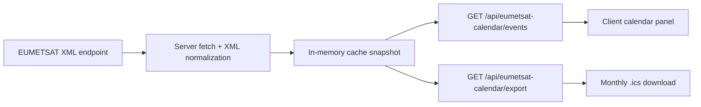

# Technical Guide: EUMETSAT Training Calendar Integration

## Scope

This guide describes an end-to-end integration with the public EUMETSAT training events endpoint using `Next.js`, `App Router`, `Route Handlers`, `React Server Components`, server-side caching, lightweight client polling, and `.ics` export.

The goal is to help another team:

- consume the EUMETSAT feed without relying on UI scraping;
- normalize the XML into a stable JSON contract;
- filter events by delivery mode and month;
- export the exact current view as `.ics`;
- keep the interface fresh without forcing a full page reload.

## Primary references

- [EUMETSAT public training endpoint](https://trainingevents.eumetsat.int/trapi/resources/public/events)
- [EUMETSAT user portal dashboard](https://user.eumetsat.int/dashboard)
- [EUMETSAT guide: Getting started using data](https://user.eumetsat.int/resources/user-guides/getting-started-using-data)

## Methodological note

On **April 5, 2026**, the endpoint `https://trainingevents.eumetsat.int/trapi/resources/public/events` returned XML with an `<events>` root and multiple `<event>...</event>` blocks. The page at `https://user.eumetsat.int/dashboard` is heavily client-side, so this guide was built from the public endpoint and the observed dashboard behavior, not from scraping rendered HTML.

## Adopted architecture



## Why XML is parsed on the server

This decision is foundational.

- The EUMETSAT feed is XML, not JSON.
- XML parsing is usually more predictable on the server.
- The server can apply caching, deduplication, and normalization before the data reaches the client.
- The client only needs to consume a local JSON route, which is much easier to test and evolve.

Operationally, this reduces:

- repeated parsing cost in the browser;
- divergence between multiple front-end implementations;
- direct coupling between the UI and an external XML schema;
- visual breakage caused by minor remote feed changes.

## Observed feed structure

The most relevant fields observed inside `<event>` blocks were:

- `title`
- `startDate`
- `endDate`
- `format`
- `eventType > value`
- `status > value`
- `attendance > value`
- `city`
- `host`
- `contactUrl`
- `registrationHowto`
- `description`
- `languages > language > value`

The `registrationHowto` field can contain free text with an embedded URL. For that reason, the guide extracts the first valid URL from that field instead of assuming the value is already clean.

## Normalized model

The XML is transformed into a predictable contract:

```ts
type GuideCalendarEvent = {
  id: string;
  title: string;
  startDate: string;
  endDate: string;
  format: "ONLINE" | "ONSITE";
  eventType: string;
  status: string | null;
  attendance: string | null;
  city: string | null;
  host: string | null;
  url: string | null;
  description: string | null;
  languages: string[];
  sourceName: string;
};
```

### Important normalization rules

- `format="ONLINE"` becomes `ONLINE`
- any other format, such as `RESIDENCE`, becomes `ONSITE`
- `registrationHowto` and `contactUrl` are collapsed into a single destination `url`
- duplicates with the same `title + startDate` are removed
- all timestamps remain in UTC

## Data scope

This guide works only with the public EUMETSAT feed.

- there are no local custom events;
- there is no extra institutional enrichment layer;
- there is no source mixing in the same dataset;
- every normalized event is emitted with `sourceName = "EUMETSAT"`.

That keeps the example more portable and more scientifically faithful to the original endpoint.

## Server-side cache

The guide uses an explicit in-memory process cache with a `2 minute` TTL.

### Why

- in-memory caching avoids reparsing the XML repeatedly inside the same Node process;
- the JSON route can respond quickly with the latest snapshot;
- the heavier XML refresh runs in the background without blocking the page.

### Limitation

This cache is process-local. If the application runs on multiple instances, each instance will keep its own cache. In multi-node environments, the next logical step is Redis or another shared cache layer.

## Automatic refresh

The client-side panel:

- requests `GET /api/eumetsat-calendar/events` on mount;
- retries every `5 seconds` while the cache is still warming up;
- switches to every `60 seconds` once data is present;
- refreshes again when the tab regains focus;
- refreshes again when the tab becomes visible.

This balances:

- moderate network cost;
- data that remains fresh enough for a dashboard;
- operational simplicity.

## Why the guide uses UTC

The entire calendar operates in UTC for a direct reason: international feeds are consumed across multiple time zones. If the UI relied on the browser's local timezone to build the month grid and group events by day, an event close to midnight could appear on a different day depending on the viewer's country.

### Adopted rule set

- `month key` in UTC
- `day key` in UTC
- month grid in UTC
- `.ics` export in UTC

If an organization needs to display everything in the viewer's local time, the recommended approach is:

1. keep the backend in UTC;
2. convert only in the presentation layer;
3. do not use local time to group the source dataset.

## `.ics` export

The `.ics` file is built manually to preserve full fidelity with the filter currently applied in the dashboard.

Primary fields used:

- `UID`
- `DTSTAMP`
- `DTSTART`
- `DTEND`
- `SUMMARY`
- `DESCRIPTION`
- `LOCATION`
- `CATEGORIES`
- `ORGANIZER`
- `URL`

### Why generate it manually

- the required format is small and controlled;
- it avoids another dependency;
- it makes the full pipeline easier to explain;
- it guarantees that export and UI use the exact same filters.

## End-to-end flow

1. The server fetches the EUMETSAT XML feed.
2. Each `<event>` block is parsed.
3. The dataset is cleaned, deduplicated, and normalized.
4. The normalized set is stored in cache.
5. The server-rendered page responds immediately and starts cache warmup in parallel.
6. The client panel keeps polling the local JSON route.
7. The user filters by format and month.
8. The same filtered view can be exported as `.ics`.

## Integration into another project

This example is intentionally packaged as a separate mini application. To embed it into another dashboard:

1. move `app/eumetsat-calendar/page.tsx` to the route you want;
2. move `components` and `lib` into your project's namespaces;
3. replace relative imports with your local aliases if needed;
4. adjust the XML source and cache policy only if your requirements differ;
5. if the route must be protected, add middleware or route-level auth checks.

## Error handling and graceful degradation

The guide handles external feed failures in a resilient way:

- if EUMETSAT is temporarily unavailable, the last valid snapshot remains available;
- the panel does not crash;
- the JSON route continues to respond;
- the UI only reports feed unavailability when there is no dataset at all to display.

That behavior is preferable to failing the entire screen, especially in operational dashboards.

## Future optimizations

- replace regex-based extraction with a stricter XML parser if a stable schema is guaranteed;
- persist shared cache in Redis or another distributed store;
- honor `etag` or `last-modified` headers if the endpoint starts exposing them;
- paginate or virtualize the day list if event density grows;
- add authentication and audit logging to `.ics` export if required.

## Scientific and operational interpretation

Although the calendar may appear to be only a visual widget, it effectively acts as an interoperability layer between:

- external institutional metadata;
- a unified temporal representation;
- export in an open calendar standard.

That convergence requires rigor across three axes:

- **semantics**: the same entity must preserve the same meaning across transformations;
- **temporality**: the event must remain on the correct day regardless of timezone;
- **reproducibility**: the exported `.ics` must represent exactly the same slice that is visible in the UI.

That is why the guide emphasizes normalization, UTC, caching, and typed contracts.
